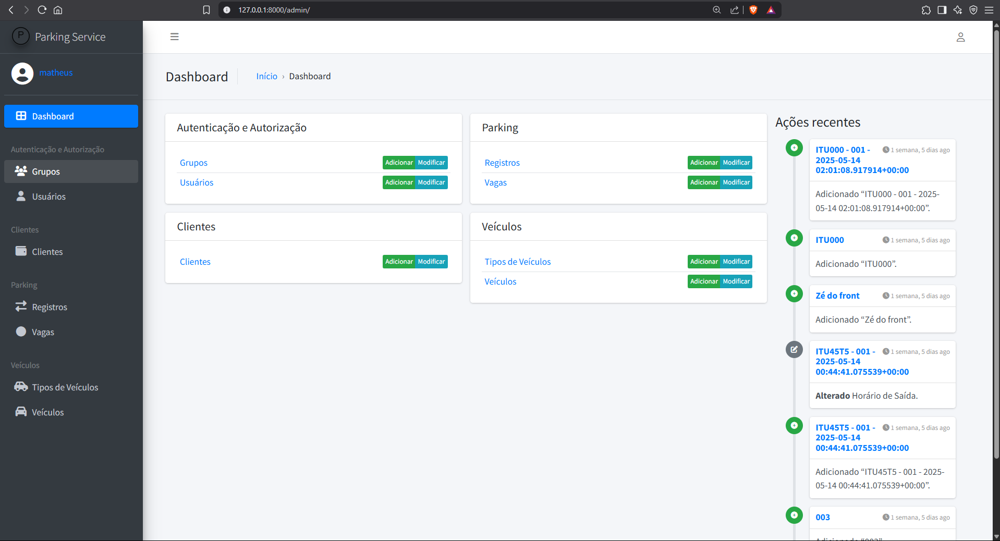

# 🚗 Parking Service

Projeto pessoal de um sistema de controle de estacionamento desenvolvido com **Python** e **Django**, com foco em aprendizado, boas práticas e estrutura de API.

> ⚠️ Este projeto está em desenvolvimento (MVP) e novas funcionalidades estão sendo adicionadas gradualmente.

> 🎓 Projeto desenvolvido com base em um tutorial do YouTube, com adaptações e melhorias feitas por mim ao longo do aprendizado.

---

## 📋 Funcionalidades

### ✔️ Funcionais já implementadas:

- **Sistema de administração interno**
  - Controle de usuários, acessos e permissões
  - Cadastros de:
    - Clientes
    - Veículos
    - Vagas
    - Entradas e saídas de veículos
  - Status automático das vagas (livre/ocupado)

- **API para futuras integrações**
  - Endpoints REST completos para:
    - Clientes
    - Veículos
    - Vagas
    - Entradas/saídas
  - Autenticação JWT
  - Filtros e busca
  - Acesso restrito aos próprios dados (clientes)

- **Busca automática de dados dos veículos pela placa**
  - Consulta via API externa
  - Task assíncrona (Celery + RabbitMQ)

---

## 🛠 Tecnologias e Ferramentas

- Django
- Django Rest Framework
- PostgreSQL
- Django Jazzmin (painel administrativo customizado)
- JWT Authentication
- Celery + RabbitMQ
- RQL (Resource Query Language) para filtros
- Flake8 (linter)
- Docker (em breve)
- Swagger (em breve)

---

## 🚀 Como rodar o projeto

> Pré-requisitos: Python 3.11+ e pip.

1. Clone o repositório:
```bash
git clone https://github.com/seu-usuario/parking-service.git
pip install -r requirements.txt
python manage.py migrate
python manage.py createsuperuser
python manage.py runserver
http://127.0.0.1:8000/

---

📷 Imagens 
     

---

🧠 Objetivo
     Este projeto faz parte do meu processo de aprendizado em desenvolvimento backend com Django. A ideia surgiu a partir de um tutorial do YouTube que estou acompanhando, e estou adaptando e ampliando conforme aprendo. Serve como portfólio e prova prática das habilidades que venho desenvolvendo.